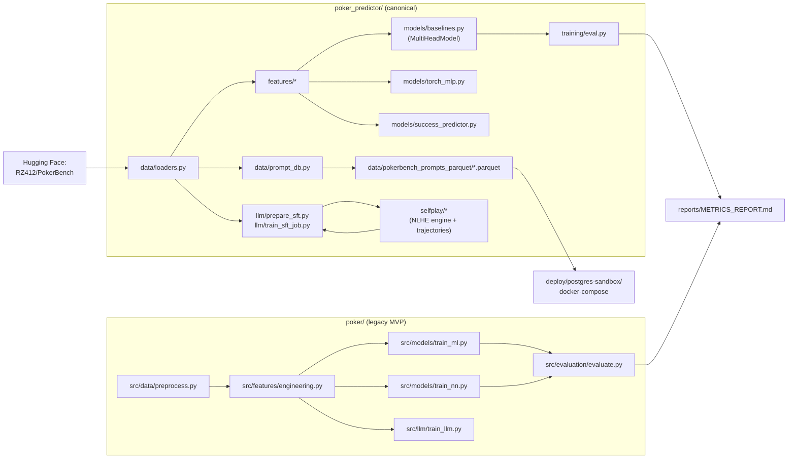

# Repository architecture

This document is the reader's map of the repo. If you're new here, read
this file after [`README.md`](README.md) — the README goes deep on the
canonical poker preflop predictor, while this file gives the
one-paragraph tour of every directory and clarifies which stack is
current versus legacy.

## Two poker stacks, one repo

There are two poker prediction stacks in this repo. They target the
same PokerBench dataset but exist at different points in the project's
history:

| Stack | Path | Status | Entry point |
|---|---|---|---|
| Canonical preflop predictor | [`poker_predictor/`](poker_predictor/) | Actively maintained; installed by [`pyproject.toml`](pyproject.toml) as the `poker-predictor` and `pokerbench-promptdb` console scripts | `pip install -e .` then `poker-predictor --help` |
| Legacy MVP | [`poker/`](poker/) | Kept for its notebooks and the comparison numbers in [`reports/METRICS_REPORT.md`](reports/METRICS_REPORT.md); not installed as a package | `pip install -r poker/requirements.txt` then `python poker/scripts/run_pipeline.py` |

Prefer `poker_predictor/` for new work. `poker/` is retained because
the two produce directly comparable leaderboards on the same test
split — see section 2 of [`reports/METRICS_REPORT.md`](reports/METRICS_REPORT.md).

## Requirements & install (single source of truth)

- The canonical `poker_predictor` stack's dependencies live in
  [`pyproject.toml`](pyproject.toml). Optional extras: `torch`, `llm`,
  `tracking`, `dev`. For users who prefer `pip install -r`,
  [`requirements/`](requirements/) mirrors those extras as feature
  layers (`base.txt`, `torch.txt`, `llm.txt`, `tracking.txt`,
  `dev.txt`, `all.txt`) — see
  [`requirements/README.md`](requirements/README.md).
- The legacy `poker/` MVP has its own layered requirements under
  [`poker/requirements/`](poker/requirements/) (`base.txt`, `ml.txt`,
  `nn.txt`, `llm.txt`, `viz.txt`, `tracking.txt`, `poker.txt`,
  `dev.txt`, `all.txt`). The top-level
  [`poker/requirements.txt`](poker/requirements.txt) is retained as a
  backwards-compatible passthrough that installs `all.txt`. See
  [`poker/requirements/README.md`](poker/requirements/README.md).
- Upper bounds `torch<3` and `transformers<5` guard against the two
  major-release regressions documented in
  [`poker/docs/BUG_AUDIT.md`](poker/docs/BUG_AUDIT.md) items 2 and 4.
- Never install the canonical and legacy stacks into the same env
  without extras — they mostly agree, but the legacy MVP's `treys` and
  `wandb` are not part of the canonical stack.

## Top-level directory tree

```
.
├── README.md                    # Canonical package README (poker_predictor deep dive)
├── ARCHITECTURE.md              # This file
├── CONTRIBUTING.md              # Dev install, tests, lint, PR conventions
├── LICENSE                      # MIT
├── pyproject.toml               # Canonical package + tooling config
├── .gitignore                   # See notes on data/ and applications/slack/
│
├── applications/                # Adjacent apps of interest (placeholder)
│   └── slack/                   # Slack-based apps (placeholder, gitignored except README)
├── automations/                 # Automation configs (placeholder)
│   └── cursor/                  # Cursor Agent automation schemas
│
├── poker_predictor/             # CANONICAL preflop predictor (installable package)
│   ├── cli.py                   # `poker-predictor` Typer CLI
│   ├── data/                    # Loaders, pydantic schemas, prev_line parser, prompt DB
│   ├── features/                # Cards, equity, position, stacks, actions, build
│   ├── models/                  # Multi-head baseline, torch MLP, success predictor
│   ├── training/                # Classical + torch training, evaluation, villain-fold labels
│   ├── llm/                     # SFT prep, HF Jobs PEP 723 training script, inference
│   └── selfplay/                # NLHE engine + PokerBench-style trajectory recorder
│
├── poker/                       # LEGACY MVP (not installed; kept for notebooks)
│   ├── README.md                # MVP-focused readme
│   ├── PROJECT_SUMMARY.md       # High-level project summary
│   ├── requirements.txt         # MVP-specific dependency file
│   ├── configs/                 # YAML configs for train_ml / train_nn / train_llm
│   ├── data/                    # {raw, processed, models}/  (gitignored contents)
│   ├── docs/                    # GETTING_STARTED, USAGE, ROADMAP, BUG_AUDIT
│   ├── notebooks/               # 01_quickstart + 02_prediction_success_evaluation
│   ├── requirements/            # Feature-layered dependency files (base/ml/nn/llm/…)
│   ├── scripts/                 # download_data.py + run_pipeline.py
│   ├── src/                     # data / features / models / evaluation / llm
│   └── tests/                   # Regression tests for the MVP
│
├── notebooks/                   # Canonical, top-level notebooks (01–04)
├── reports/                     # METRICS_REPORT.md + PROMPT_DB_CANVAS.md
├── scripts/                     # Repo-level helper scripts
├── deploy/                      # Deployment artifacts (Postgres sandbox)
├── data/                        # Committed parquet mirror + gitignored working dirs
├── requirements/                # Feature-layered mirrors of pyproject extras
└── tests/                       # Canonical pytest suite for poker_predictor/
```

## How the pieces talk to each other



## Notebooks

- [`notebooks/`](notebooks/) — the four canonical notebooks driving the
  numbers in the root README and `reports/METRICS_REPORT.md` (EDA,
  baseline, multi-algo evaluation, RF success predictors).
- [`poker/notebooks/`](poker/notebooks/) — two MVP notebooks (quickstart
  end-to-end + prediction-success evaluation) used by the legacy
  numbers.

## Data layout

- [`data/pokerbench_prompts_parquet/`](data/pokerbench_prompts_parquet/)
  — committed parquet mirror of the SQL prompt DB (~9 MB, six
  tables). Regenerated from the SQLite build via
  `pokerbench-promptdb export-parquet`.
- `data/pokerbench_prompts.sqlite` — the SQLite build itself.
  **Gitignored**; regenerable in ~15 s via
  [`scripts/spin_up_prompt_sandbox.sh`](scripts/spin_up_prompt_sandbox.sh).
- `data/{raw,interim,processed}/` — gitignored working directories used
  by the CLI verbs `ingest` / `featurize` / `train` / `eval`.
- `poker/data/{raw,processed,models}/` — gitignored working directories
  for the legacy MVP.

## Further reading

- [`README.md`](README.md) — deep dive on `poker_predictor/`.
- [`poker/README.md`](poker/README.md) — legacy MVP overview.
- [`reports/METRICS_REPORT.md`](reports/METRICS_REPORT.md) — every
  quantitative result on this branch.
- [`reports/PROMPT_DB_CANVAS.md`](reports/PROMPT_DB_CANVAS.md) — the
  PokerBench prompt SQL sandbox walkthrough.
- [`poker/docs/BUG_AUDIT.md`](poker/docs/BUG_AUDIT.md) — known
  code-level issues in the legacy MVP.
- [`CONTRIBUTING.md`](CONTRIBUTING.md) — dev install, tests, PRs.
