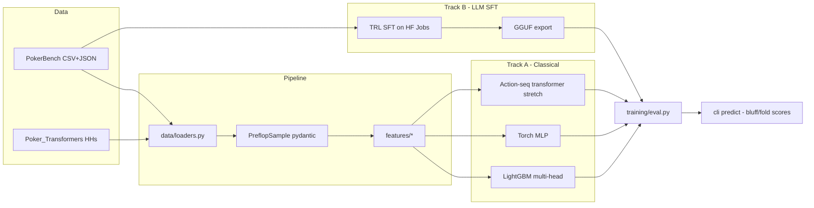
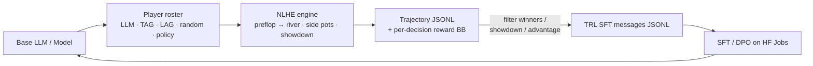

# Agent_Officespace

An agent access terminal for *Existential Ventures LLC* projects.

## Poker Preflop Predictor

`poker_predictor/` is a preflop poker prediction library and CLI. It ingests
[RZ412/PokerBench](https://huggingface.co/datasets/RZ412/PokerBench) (and
compatible JSON/CSV hand-history schemas such as
[SoelMgd/Poker_Transformers](https://github.com/SoelMgd/Poker_Transformers)),
engineers preflop features, and trains a multi-head model that produces:

- `p_hero_fold` — probability the hero *should* fold (from solver labels).
- Full action distribution over `{fold, check, call, raise, allin}`.
- `p_villain_fold` — probability the *opponent* folds to an aggressive hero
  action (the "bluff success" signal).
- `bluff_EV` — an interpretable score `p_villain_fold * pot − (1 − p_villain_fold) * bet_size`.

A parallel LLM fine-tune track (TRL SFT on Hugging Face Jobs) is scaffolded
under `poker_predictor/llm/` so the same data can produce a chat-model
"strategist" that consumes natural-language scenarios.

### Architecture



### Layout

```
poker_predictor/
  data/       loaders, pydantic schemas, prev_line parser
  features/   cards (169 classes), equity, position, actions, stacks
  models/     LightGBM multi-head, torch MLP
  training/   train_classical, train_torch, eval, villain-fold label
  llm/        PokerBench->chat SFT prep, PEP-723 HF Jobs script, inference
  cli.py      typer CLI: ingest / featurize / train / eval / predict
tests/        parser + feature tests
```

### Install

Editable install with `pyproject.toml` extras:

```bash
pip install -e .            # base classical stack
pip install -e '.[torch]'   # add PyTorch MLP baseline
pip install -e '.[llm]'     # add transformers/trl/peft for the LLM track
```

Or, if you prefer `pip install -r`, feature-layered mirrors of the
extras live under [`requirements/`](requirements/):

```bash
pip install -r requirements/base.txt       # classical stack only
pip install -r requirements/torch.txt      # + PyTorch MLP
pip install -r requirements/llm.txt        # + LLM SFT track
pip install -r requirements/tracking.txt   # + Trackio
pip install -r requirements/dev.txt        # + pytest / ruff / mypy
pip install -r requirements/all.txt        # everything
```

See [`requirements/README.md`](requirements/README.md) for the layer
graph and per-use-case picks.

### Usage

```bash
poker-predictor ingest --split train --limit 60000
poker-predictor featurize --split train
poker-predictor train --model lightgbm
poker-predictor eval --split test

poker-predictor predict \
  --hero-pos BTN --hero-hole AhKh \
  --hero-stack-bb 100 --num-players 6 --pot-bb 6.5 \
  --prev-line "UTG/2.5bb/HJ/fold/CO/call" \
  --available-moves "fold,call,raise" \
  --bet-size-bb 8
```

### LLM fine-tune track

Prepare an SFT JSONL from the PokerBench prompt/label JSON:

```bash
python -m poker_predictor.llm.prepare_sft --split train --output-dir data/sft
```

Fine-tune on Hugging Face Jobs (LoRA on Llama-3.2-3B by default):

```bash
hf jobs uv run --flavor a10-large --secrets HF_TOKEN \
  poker_predictor/llm/train_sft_job.py \
  --base-model meta-llama/Llama-3.2-3B-Instruct \
  --dataset RZ412/PokerBench \
  --output-repo <hf-user>/pokerbench-preflop-sft
```

#### Reasoning-trace augmentation (distillation from GPT-4o / a GTO solver)

Fine-tuning a small LLM directly on `<prompt> -> <action>` leaves the
student unable to generalise. The
[`poker_predictor/llm/reasoning/`](poker_predictor/llm/reasoning/)
subpackage runs each PokerBench row through a strong labeler (GPT-4o,
a local GTO solver's HTTP wrapper, or an offline deterministic
template) to insert a 4–8 sentence chain-of-thought between the user
prompt and the final action:

```bash
# 20-row smoke test with the offline template labeler (no API needed)
poker-predictor reason generate --source hub --split test \
    --labeler template --output data/reasoning_sft_test.jsonl --limit 20

# Full 60k GPT-4o labeling pass (OPENAI_API_KEY required)
poker-predictor reason generate --source hub --split train \
    --labeler openai --openai-model gpt-4o \
    --output data/reasoning_sft_train.jsonl

# Or point at a local PioSolver / GTO+ HTTP wrapper
poker-predictor reason generate --source hub --split train \
    --labeler solver --solver-endpoint http://localhost:8080/label \
    --output data/reasoning_sft_train.jsonl
```

The output JSONL is the same `{"messages": [...]}` shape as
`prepare_sft.py`, so it plugs straight into `train_sft_job.py`. The
pipeline is checkpointed — a mid-run failure resumes without
re-labeling completed rows, which matters when the labeler costs
money per call. Install extras with `pip install -e '.[reason]'`
(or `pip install -r requirements/reason.txt`). Full walkthrough,
including the HTTP contract for wrapping the popular native
solvers, is in
[`poker_predictor/llm/reasoning/README.md`](poker_predictor/llm/reasoning/README.md).

### Evaluation

`poker-predictor eval` reports on the 1k PokerBench preflop test split:

- `top1_accuracy` — hero-action accuracy vs solver.
- `action_log_loss` — proxy for KL divergence from the solver's mixed
  strategy.
- `villain_fold_brier` — calibration of the bluff-success head.
- `bluff_ev_mean` / `bluff_positive_frac` — the aggregate bluff-EV backtest.

### Notebooks

Three top-level notebooks under [`notebooks/`](notebooks/) run end-to-end
against the live PokerBench download and are re-executed as part of this
branch:

| notebook | what it does |
|---|---|
| [`01_eda_preflop.ipynb`](notebooks/01_eda_preflop.ipynb) | Preflop EDA: canonical action distribution, position mix, pot / stack profile, hand-class action mix. |
| [`02_baseline_metrics.ipynb`](notebooks/02_baseline_metrics.ipynb) | Trains the LightGBM multi-head baseline via `poker_predictor.training.train_classical.train` and reports `top1_accuracy`, `action_log_loss`, `villain_fold_brier`, `bluff_ev_mean`, `bluff_positive_frac` on the 1k test split. |
| [`03_prediction_success_evaluation.ipynb`](notebooks/03_prediction_success_evaluation.ipynb) | **Prediction-of-success evaluation**: trains 5 algorithm families on identical features (logistic, random forest, hist-gradient-boosting, LightGBM, XGBoost) and reports accuracy / macro-F1 / log-loss / top-2 accuracy / per-class metrics / fit-time / inference throughput, plus per-model confusion matrices, a shared calibration curve on `p(raise)`, and a bluff-EV backtest against the dedicated villain-fold head. Results are persisted to `artifacts/prediction_success_eval/multi_algo_results.json`. |
| [`04_rf_action_and_success_predictors.ipynb`](notebooks/04_rf_action_and_success_predictors.ipynb) | **Random Forest action classifiers + Random Forest *success* predictors**. Part A trains 4 RF variants (baseline / deep / class-balanced / isotonic-calibrated) on the same features and ranks them. Part B trains, for each of 4 primary action models (LightGBM / XGBoost / RF-tuned / logistic), an `RandomForestClassifier`-backed `SuccessPredictor` (`poker_predictor.models.success_predictor`) that estimates *"will the primary be correct on this specific spot?"*. Reports ROC-AUC / PR-AUC / Brier of the meta-model vs a naive `max(proba)` confidence baseline, plots per-primary coverage-vs-retained-accuracy curves, and outputs a **trust-policy table** ("at what confidence threshold can I automate 99% / 98% / 97% / 95% of the spots?"). Results are persisted to `artifacts/rf_success_predictor/rf_success_results.json`. |

Latest execution of `03_prediction_success_evaluation.ipynb` (20 000 training
rows, 1 000 test rows, 4 canonical actions):

| model | accuracy | macro-F1 | log-loss | top-2 acc | fit (s) |
|---|---:|---:|---:|---:|---:|
| xgboost       | 0.964 | 0.964 | 0.111 | 0.999 | 2.0 |
| hist_gbm      | 0.954 | 0.954 | 0.211 | 0.980 | 2.6 |
| lightgbm      | 0.951 | 0.951 | 0.140 | 0.992 | 3.2 |
| random_forest | 0.943 | 0.943 | 0.187 | 0.998 | 1.3 |
| logistic      | 0.821 | 0.820 | 0.364 | 0.996 | 1.9 |

Latest execution of `04_rf_action_and_success_predictors.ipynb` (12k
primary-train rows, 8k meta-train rows, 1k test rows):

**Random Forest action classifiers (Part A)**

| variant | accuracy | log-loss |
|---|---:|---:|
| rf_deep            | 0.949 | 0.177 |
| rf_baseline        | 0.940 | 0.234 |
| rf_balanced        | 0.936 | 0.167 |
| rf_calibrated_iso  | 0.922 | 0.635 |

**Random Forest success predictors (Part B) — ROC-AUC on "is primary right?"**

| primary | naive `max(proba)` | **RF meta-model** | Δ |
|---|---:|---:|---:|
| lightgbm | 0.897 | **0.919** | +0.022 |
| xgboost  | 0.857 | **0.898** | +0.041 |
| rf_tuned | 0.861 | **0.924** | +0.063 |
| logistic | 0.829 | **0.903** | +0.074 |

**Trust policy — max coverage while retaining ≥ 99% accuracy on kept spots**

| primary | full-cov acc | 99% target coverage |
|---|---:|---:|
| lightgbm | 0.947 | 0.894 |
| xgboost  | 0.961 | 0.852 |
| rf_tuned | 0.949 | 0.821 |
| logistic | 0.814 | 0.541 |

Run any notebook with:

```bash
jupyter nbconvert --to notebook --execute notebooks/03_prediction_success_evaluation.ipynb --output 03_prediction_success_evaluation.ipynb
jupyter nbconvert --to notebook --execute notebooks/04_rf_action_and_success_predictors.ipynb --output 04_rf_action_and_success_predictors.ipynb
```

### PokerBench prompt SQL sandbox

A queryable, cloud-shippable database of every natural-language
"situation-stylized" prompt in the PokerBench preflop split. See
[`reports/PROMPT_DB_CANVAS.md`](reports/PROMPT_DB_CANVAS.md) for the
full walkthrough (ERD, table reference, 10 worked queries, cloud
publish path). Quick start:

```bash
# 1) Local SQLite sandbox (builds in ~15 s, opens the sqlite3 REPL)
bash scripts/spin_up_prompt_sandbox.sh

# 2) Ad-hoc query (console entry point installed by `pip install -e .`)
pokerbench-promptdb query \
    "SELECT hero_pos, canonical_label, COUNT(*)
       FROM situations GROUP BY 1,2 ORDER BY 1,2" \
    --db-path data/pokerbench_prompts.sqlite

# 3) Postgres sandbox (docker-compose: Postgres 16 + Adminer + loader)
docker compose -f deploy/postgres-sandbox/docker-compose.yml up -d

# 4) Publish to Hugging Face Datasets (SQLite + Parquet mirror)
pokerbench-promptdb publish-hf <you>/pokerbench-prompt-db
```

Materialised from `RZ412/PokerBench` (60k train + 1k test):
**64,200 situations · 283,750 prev-line actions · 138,331 available-move
rows · 385,200 seat rows · 57 raw label variants → 4 canonical labels ·
6 decision-type classes**. Every prompt slot (positions, blinds, hero
holding, prev-line, pot size) is parsed into a normalised column, so
queries like "what's the solver's mix on BTN with AKo?" or "which hand
classes are most often facing an all-in?" are one-liner SQL. Full
schema: [`poker_predictor/data/prompt_db.py`](poker_predictor/data/prompt_db.py).

### Consolidated metrics report

Every quantitative result produced by the notebooks and scripts on this
branch is consolidated in [`reports/METRICS_REPORT.md`](reports/METRICS_REPORT.md).
It covers:

- Multi-algorithm action leaderboards for both `poker_predictor/` (20k
  train) and `poker/` (15.2k + 50.6k train).
- Per-class precision / recall / F1 tables and confusion matrices.
- Poker-domain metrics (`top1_accuracy`, `action_log_loss`,
  `villain_fold_brier`, `bluff_ev_mean`, `bluff_positive_frac`).
- Four Random Forest action variants (baseline / deep / balanced /
  isotonic-calibrated).
- Success-of-prediction meta-model results: ROC-AUC / PR-AUC / Brier
  for each primary, coverage-vs-accuracy curves, and a trust-policy
  table for automating decisions at target accuracy levels 95% / 97%
  / 98% / 99%.

### Self-play synthetic data

`poker_predictor/selfplay/` is a self-play data-generation pipeline that
lets the LLM (or any other configured player) play No Limit Hold'em
against itself and a roster of baseline opponents, emitting
PokerBench-compatible ``{instruction, output, reward_bb}`` decision rows
that plug directly back into the SFT track — the exponential-improvement
loop.



Layout:

```
poker_predictor/selfplay/
  hand_eval.py   7-card evaluator (21-subset best-5 rank tuple)
  engine.py     NLHEEngine (dealing, blinds, side pots, showdown)
  prompts.py    PokerBench-style DecisionPrompt renderer + response parser
  players.py    Player ABC + Random / Heuristic / TAG / LAG / LLM / PolicyModel
  reward.py     Trajectory credit assignment + filters
  runner.py     SelfPlayEngine, save_jsonl, run_generation_loop
  cli.py        `poker-predictor selfplay {run,loop,demo,prepare-sft}`
```

Quick start (no model needed — heuristic-only baseline):

```bash
poker-predictor selfplay demo --num-hands 2 \
    --roster "heuristic,tag,lag,random,heuristic,tag"

poker-predictor selfplay run --num-hands 500 --num-seats 6 \
    --roster "heuristic,tag,lag,random,heuristic,tag" \
    --output data/selfplay/gen0_decisions.jsonl \
    --sft-output data/selfplay/gen0_sft.jsonl \
    --filter-winners
```

Iterative self-improvement loop (K generations):

```bash
poker-predictor selfplay loop --generations 3 --hands-per-generation 2000 \
    --roster "heuristic,tag,lag,random,heuristic,tag" \
    --output-dir data/selfplay/loop --filter-winners
```

To put your fine-tuned LLM in the seat, use the ``llm:<hf-id>`` or
``llm_gguf:<path>`` roster tokens (also ``policy:<joblib-path>`` for the
classical LightGBM model):

```bash
poker-predictor selfplay run --num-hands 1000 \
    --roster "llm:my-user/pokerbench-preflop-sft,tag,lag,random,heuristic,tag" \
    --sft-output data/selfplay/gen1_sft.jsonl --filter-winners
```

Feed the resulting ``gen{N}_sft.jsonl`` back into
``poker_predictor/llm/train_sft_job.py`` (via HF Jobs) alongside
PokerBench to train the next generation. Full API is exposed in
``poker_predictor.selfplay``:

```python
from poker_predictor.selfplay import (
    SelfPlayEngine, HeuristicPlayer, TightAggressivePlayer,
    LooseAggressivePlayer, RandomPlayer, keep_winning_actions,
    prepare_sft_from_trajectories,
)

engine = SelfPlayEngine(
    players=[HeuristicPlayer(f"h{i}") for i in range(4)] + [TightAggressivePlayer("tag"), LooseAggressivePlayer("lag")],
    num_seats=6, starting_stack_bb=100.0,
)
trajectories = engine.run(num_hands=1000, seed=0)
rows = [row for t in trajectories for row in t.decisions_with_reward()]
prepare_sft_from_trajectories(keep_winning_actions(rows), "data/selfplay/winners_sft.jsonl")
```

Chip-conservation and 2-9 seat variants are covered by regression tests
in ``tests/test_selfplay_*.py``.

### Refinement roadmap

Concrete extensions once we ingest richer data:

- **Opponent modeling.** Join per-player VPIP / PFR / 3B / fold-to-3B stats
  (from real hand-history datasets like IRC Poker DB, Pluribus logs, or
  Poker_Transformers HHs) as new features. Enables exploitative deviations
  from the GTO baseline.
- **Sequence models.** Replace the tabular MLP with a small transformer over
  the tokenized action history — bridges directly into the
  Poker_Transformers approach and lets us fold in unlabeled hand histories
  as pretraining.
- **Range vs range equity.** Replace point-equity with range-vs-range
  computed against assumed opponent ranges per position/action.
- **Bayesian calibration.** Shrink per-opponent stats toward population
  priors when sample size is small.
- **Bluff-timing signal.** Once live-client data is plumbed in, add
  `time_to_act_ms` and hesitation features — physical timing is one of the
  strongest bluff signals not present in solver datasets.
- **Active learning / RL loop.** Use the supervised model as a policy prior
  and refine with CFR / self-play; use the fine-tuned LLM as a language-level
  policy that can be distilled back into the classical model. The core
  engine + trajectory recorder for this loop already lives in
  [`poker_predictor/selfplay/`](poker_predictor/selfplay/) — see the
  *Self-play synthetic data* section above.
- **Data quality flags.** Dedup near-identical spots, split by stack-depth
  bucket, and enforce leak-free train/test partitions.

### Tests

```bash
pytest -q
```

---

_See [`applications/`](applications/) and [`automations/`](automations/) for
other subprojects in this workspace._
