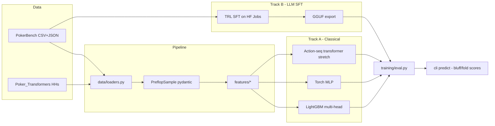

# Agent_Officespace

An agent access terminal for *Existential Ventures LLC* projects.

## Poker Preflop Predictor

`poker_predictor/` is a preflop poker prediction library and CLI. It ingests
[RZ412/PokerBench](https://huggingface.co/datasets/RZ412/PokerBench) (and
compatible JSON/CSV hand-history schemas such as
[SoelMgd/Poker_Transformers](https://github.com/SoelMgd/Poker_Transformers)),
engineers preflop features, and trains a multi-head model that produces:

- `p_hero_fold` — probability the hero *should* fold (from solver labels).
- Full action distribution over `{fold, check, call, raise, allin}`.
- `p_villain_fold` — probability the *opponent* folds to an aggressive hero
  action (the "bluff success" signal).
- `bluff_EV` — an interpretable score `p_villain_fold * pot − (1 − p_villain_fold) * bet_size`.

A parallel LLM fine-tune track (TRL SFT on Hugging Face Jobs) is scaffolded
under `poker_predictor/llm/` so the same data can produce a chat-model
"strategist" that consumes natural-language scenarios.

### Architecture



### Layout

```
poker_predictor/
  data/       loaders, pydantic schemas, prev_line parser
  features/   cards (169 classes), equity, position, actions, stacks
  models/     LightGBM multi-head, torch MLP
  training/   train_classical, train_torch, eval, villain-fold label
  llm/        PokerBench->chat SFT prep, PEP-723 HF Jobs script, inference
  cli.py      typer CLI: ingest / featurize / train / eval / predict
tests/        parser + feature tests
```

### Install

```bash
pip install -e .            # base classical stack
pip install -e '.[torch]'   # add PyTorch MLP baseline
pip install -e '.[llm]'     # add transformers/trl/peft for the LLM track
```

### Usage

```bash
poker-predictor ingest --split train --limit 60000
poker-predictor featurize --split train
poker-predictor train --model lightgbm
poker-predictor eval --split test

poker-predictor predict \
  --hero-pos BTN --hero-hole AhKh \
  --hero-stack-bb 100 --num-players 6 --pot-bb 6.5 \
  --prev-line "UTG/2.5bb/HJ/fold/CO/call" \
  --available-moves "fold,call,raise" \
  --bet-size-bb 8
```

### LLM fine-tune track

Prepare an SFT JSONL from the PokerBench prompt/label JSON:

```bash
python -m poker_predictor.llm.prepare_sft --split train --output-dir data/sft
```

Fine-tune on Hugging Face Jobs (LoRA on Llama-3.2-3B by default):

```bash
hf jobs uv run --flavor a10-large --secrets HF_TOKEN \
  poker_predictor/llm/train_sft_job.py \
  --base-model meta-llama/Llama-3.2-3B-Instruct \
  --dataset RZ412/PokerBench \
  --output-repo <hf-user>/pokerbench-preflop-sft
```

### Evaluation

`poker-predictor eval` reports on the 1k PokerBench preflop test split:

- `top1_accuracy` — hero-action accuracy vs solver.
- `action_log_loss` — proxy for KL divergence from the solver's mixed
  strategy.
- `villain_fold_brier` — calibration of the bluff-success head.
- `bluff_ev_mean` / `bluff_positive_frac` — the aggregate bluff-EV backtest.

### Refinement roadmap

Concrete extensions once we ingest richer data:

- **Opponent modeling.** Join per-player VPIP / PFR / 3B / fold-to-3B stats
  (from real hand-history datasets like IRC Poker DB, Pluribus logs, or
  Poker_Transformers HHs) as new features. Enables exploitative deviations
  from the GTO baseline.
- **Sequence models.** Replace the tabular MLP with a small transformer over
  the tokenized action history — bridges directly into the
  Poker_Transformers approach and lets us fold in unlabeled hand histories
  as pretraining.
- **Range vs range equity.** Replace point-equity with range-vs-range
  computed against assumed opponent ranges per position/action.
- **Bayesian calibration.** Shrink per-opponent stats toward population
  priors when sample size is small.
- **Bluff-timing signal.** Once live-client data is plumbed in, add
  `time_to_act_ms` and hesitation features — physical timing is one of the
  strongest bluff signals not present in solver datasets.
- **Active learning / RL loop.** Use the supervised model as a policy prior
  and refine with CFR / self-play; use the fine-tuned LLM as a language-level
  policy that can be distilled back into the classical model.
- **Data quality flags.** Dedup near-identical spots, split by stack-depth
  bucket, and enforce leak-free train/test partitions.

### Tests

```bash
pytest -q
```

---

_See [`applications/`](applications/) and [`automations/`](automations/) for
other subprojects in this workspace._
