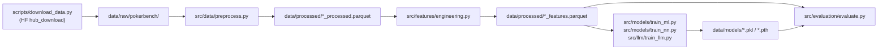

# `poker/data/` — Legacy MVP data lifecycle

Working data root for the legacy [`poker/`](..) stack. Every
subdirectory is populated by a script and every subdirectory's
contents are **gitignored** (see [`../.gitignore`](../.gitignore)) —
only the empty `.gitkeep` files are committed.

If you're new to the legacy MVP, walk the lifecycle in this order:

## Lifecycle



| Path | Populated by | Format |
|---|---|---|
| [`raw/`](raw/) | [`../scripts/download_data.py`](../scripts/download_data.py) | PokerBench CSVs (`preflop_{60k,1k}_..._game_scenario_information.csv`) and JSONs (`preflop_{60k,1k}_..._prompt_and_label.json`). |
| [`processed/`](processed/) | [`../src/data/preprocess.py`](../src/data/preprocess.py) → [`../src/features/engineering.py`](../src/features/engineering.py) | Two rounds of Parquet — `train_processed.parquet` / `test_processed.parquet`, then `train_features.parquet` / `test_features.parquet`. |
| [`models/`](models/) | [`../src/models/train_ml.py`](../src/models/train_ml.py) / [`train_nn.py`](../src/models/train_nn.py) / [`../src/llm/train_llm.py`](../src/llm/train_llm.py) | Fitted checkpoints — `.pkl` (sklearn / XGBoost / LightGBM), `.pth` (PyTorch MLP/LSTM), or an LLM output directory. |
| `evaluation/` (auto-created) | [`../src/evaluation/evaluate.py`](../src/evaluation/evaluate.py) | JSON / CSV per-model results (`multi_algo_results.json`, comparison tables). |

## One-shot pipeline

```bash
cd poker
python scripts/run_pipeline.py --model-type xgboost
```

This runs Download → Preprocess → Engineer → Train → Evaluate in
sequence. See [`../scripts/README.md`](../scripts/README.md) for
step-by-step invocations and skip flags.

## Notes

- The canonical stack uses [`../../data/`](../../data/) as *its* data
  root — do not cross-populate. The schemas differ.
- The two big committed artifacts in this repo (`.parquet` and
  `.sqlite`) live under [`../../data/`](../../data/), not here.
- BUG_AUDIT item A ("estimated_stack is a made-up multiple of the
  pot") applies to the feature parquet under `processed/` — flag any
  downstream SPR / pot-to-stack analysis with a note.
