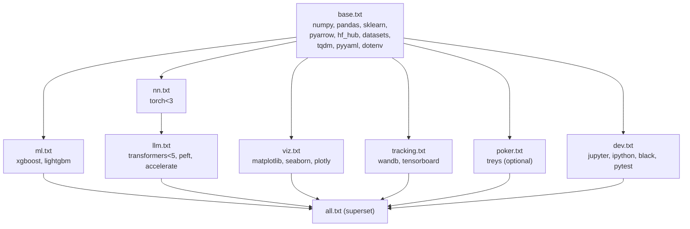

# `poker/requirements/` — feature-tailored dependency files (legacy MVP)

Feature-scoped requirements for the legacy [`poker/`](..) MVP. Each
file installs the minimum set of packages needed to enable one
capability. Files layer via `-r`, so installing a leaf pulls in
everything it needs transitively.

The old monolithic [`../requirements.txt`](../requirements.txt) is
retained as a backwards-compatible passthrough that installs
[`all.txt`](all.txt).

## Layered files

| File | Adds | Enables |
|---|---|---|
| [`base.txt`](base.txt) | numpy / pandas / sklearn / pyarrow / fastparquet / hf-hub / datasets / tqdm / pyyaml / dotenv / requests. | `src/data/preprocess.py`, `src/features/engineering.py`, `scripts/download_data.py`. |
| [`ml.txt`](ml.txt) | `-r base.txt` + xgboost + lightgbm. | `src/models/train_ml.py` and `scripts/run_pipeline.py --model-type {xgboost,lightgbm,random_forest}`. |
| [`nn.txt`](nn.txt) | `-r base.txt` + `torch<3`. | `src/models/train_nn.py` and `scripts/run_pipeline.py --model-type {mlp,lstm}`. |
| [`llm.txt`](llm.txt) | `-r nn.txt` + `transformers<5` + peft + accelerate. | `src/llm/train_llm.py` (LoRA fine-tuning). |
| [`viz.txt`](viz.txt) | `-r base.txt` + matplotlib + seaborn + plotly. | Plots in the notebooks and in `src/evaluation/evaluate.py`. |
| [`tracking.txt`](tracking.txt) | `-r base.txt` + wandb + tensorboard. | Optional experiment tracking in the NN and LLM trainers. |
| [`poker.txt`](poker.txt) | `-r base.txt` + `treys>=0.1.8`. | Optional; the current code does not import treys but future evaluators may. |
| [`dev.txt`](dev.txt) | `-r base.txt` + jupyter + ipython + black + pytest. | Notebooks in `poker/notebooks/` and tests in `poker/tests/`. |
| [`all.txt`](all.txt) | Every layer above. | Everything. Matches the old monolithic `poker/requirements.txt`. |

## Which layer do I need?

| Use case | Install |
|---|---|
| Just download PokerBench and inspect the CSVs | `pip install -r poker/requirements/base.txt` |
| Reproduce the XGBoost leaderboard | `pip install -r poker/requirements/ml.txt` |
| Train `PokerMLP` / `PokerLSTM` | `pip install -r poker/requirements/nn.txt` |
| LoRA fine-tune Mistral-7B | `pip install -r poker/requirements/llm.txt` |
| Run `poker/notebooks/*.ipynb` end-to-end | `pip install -r poker/requirements/dev.txt -r poker/requirements/viz.txt -r poker/requirements/ml.txt` |
| Log training curves to W&B / TensorBoard | `pip install -r poker/requirements/tracking.txt` |
| Everything (old default) | `pip install -r poker/requirements.txt`  (same as `all.txt`) |

## Notes

- `bitsandbytes` is deliberately omitted from `llm.txt` — it fails to
  install on CPU / Mac boxes and is only needed for the 8-bit LoRA
  code path (see BUG_AUDIT item 5 in
  [`../docs/BUG_AUDIT.md`](../docs/BUG_AUDIT.md)). Install it manually
  on Linux+CUDA if you want it: `pip install bitsandbytes`.
- The `torch<3` and `transformers<5` upper bounds guard against the
  two major-release regressions documented in BUG_AUDIT items 2 and 4.
  Bump the ceilings only after re-running `pytest -q` from `poker/`.

## Related

- Canonical stack requirements:
  [`../../requirements/`](../../requirements/).
- Legacy MVP overview: [`../README.md`](../README.md).
- Install / test conventions: [`../../CONTRIBUTING.md`](../../CONTRIBUTING.md).
