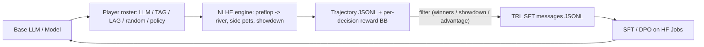

# `poker_predictor.selfplay`

Self-play data-generation pipeline. Compose an `SelfPlayEngine` with a
roster of `Player` instances and generate PokerBench-compatible
`{"instruction", "output", "reward_bb"}` decision rows that plug
directly back into the SFT track — the exponential-improvement loop.

## The loop

```
gen_0:  base LLM + heuristic opponents  → data_0
train:  data_0 → LLM_v1
gen_1:  LLM_v1 vs LLM_v1 vs heuristic   → data_1  (harder distribution)
train:  data_0 + data_1 → LLM_v2
...
```



## Modules

| Module | Purpose |
|---|---|
| [`hand_eval.py`](hand_eval.py) | 7-card evaluator: enumerate all 21 5-card subsets, return the best `(rank, kickers)` tuple. Used for showdown resolution. |
| [`engine.py`](engine.py) | `NLHEEngine` — deal → blinds → preflop / flop / turn / river with side-pot handling and showdown. Emits a `HandResult` per hand. |
| [`prompts.py`](prompts.py) | `DecisionPrompt` renderer that reuses PokerBench's natural-language "situation-stylized" format for LLM-driven players, plus `parse_action_response` to convert the model's reply back into a legal engine action. |
| [`players.py`](players.py) | `Player` ABC + `PlayerRoster`, plus concrete players: `RandomPlayer`, `HeuristicPlayer`, `TightAggressivePlayer`, `LooseAggressivePlayer`, `LLMPlayer` (any HF/GGUF model), `PolicyModelPlayer` (wraps a classical joblib policy — e.g. a `MultiHeadModel`). |
| [`reward.py`](reward.py) | `TrajectoryDecision`, `HandTrajectory`, and filters: `keep_winning_actions`, `keep_showdown_actions`, `keep_positive_expectation`. `compute_advantage` estimates per-decision credit assignment (final BB delta) so the same trajectory file can drive weighted SFT, best-of-N filtering, or policy-gradient variants. |
| [`runner.py`](runner.py) | `SelfPlayEngine`, `SelfPlayConfig`, `save_jsonl`, `run_generation_loop`, `prepare_sft_from_trajectories` (trajectories → TRL messages JSONL). |
| [`cli.py`](cli.py) | The `poker-predictor selfplay {run, loop, demo, prepare-sft}` subcommand. |

## Quick start (no model needed)

Heuristic-only demo — plays 2 hands, prints trajectories:

```bash
poker-predictor selfplay demo --num-hands 2 \
    --roster "heuristic,tag,lag,random,heuristic,tag"
```

Full 500-hand generation, writing both raw trajectories and an SFT
JSONL of only winning actions:

```bash
poker-predictor selfplay run --num-hands 500 --num-seats 6 \
    --roster "heuristic,tag,lag,random,heuristic,tag" \
    --output data/selfplay/gen0_decisions.jsonl \
    --sft-output data/selfplay/gen0_sft.jsonl \
    --filter-winners
```

## Iterative improvement loop

```bash
poker-predictor selfplay loop --generations 3 --hands-per-generation 2000 \
    --roster "heuristic,tag,lag,random,heuristic,tag" \
    --output-dir data/selfplay/loop --filter-winners
```

## Put your fine-tuned LLM in the seat

Roster tokens accept `llm:<hf-id>`, `llm_gguf:<path>`, and
`policy:<joblib-path>`:

```bash
poker-predictor selfplay run --num-hands 1000 \
    --roster "llm:my-user/pokerbench-preflop-sft,tag,lag,random,heuristic,tag" \
    --sft-output data/selfplay/gen1_sft.jsonl --filter-winners
```

Then feed the resulting `gen{N}_sft.jsonl` back into
[`../llm/train_sft_job.py`](../llm/train_sft_job.py) (via HF Jobs)
alongside PokerBench to train the next generation.

## Python API

```python
from poker_predictor.selfplay import (
    SelfPlayEngine, HeuristicPlayer, TightAggressivePlayer,
    LooseAggressivePlayer, keep_winning_actions,
    prepare_sft_from_trajectories,
)

engine = SelfPlayEngine(
    players=[HeuristicPlayer(f"h{i}") for i in range(4)]
            + [TightAggressivePlayer("tag"), LooseAggressivePlayer("lag")],
    num_seats=6, starting_stack_bb=100.0,
)
trajectories = engine.run(num_hands=1000, seed=0)
rows = [row for t in trajectories for row in t.decisions_with_reward()]
prepare_sft_from_trajectories(keep_winning_actions(rows),
                               "data/selfplay/winners_sft.jsonl")
```

## Tests

Chip-conservation and 2-9 seat variants are locked in by the
regression tests:

- [`../../tests/test_selfplay_hand_eval.py`](../../tests/test_selfplay_hand_eval.py)
- [`../../tests/test_selfplay_engine.py`](../../tests/test_selfplay_engine.py)
- [`../../tests/test_selfplay_runner.py`](../../tests/test_selfplay_runner.py)
