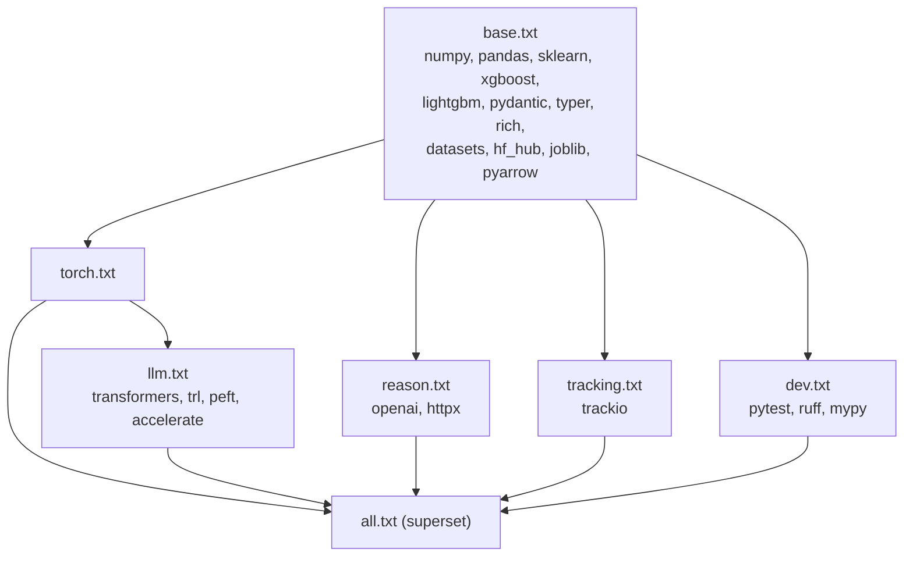

# `requirements/` — feature-tailored dependency files (canonical stack)

The canonical `poker_predictor/` package's dependencies are defined
first-class in [`../pyproject.toml`](../pyproject.toml). If you want
to install the package the modern way, just run:

```bash
pip install -e '.[torch,llm,tracking,dev]'
```

This directory exists for users who prefer `pip install -r
requirements/*.txt` — CI images, air-gapped installs, teams that
haven't adopted PEP 621 tooling, or people who want to inspect the
dependency layers without opening a TOML file. Each file mirrors one
of the extras in `pyproject.toml`.

## Layered files

Files layer via `-r` includes: install one, and its `-r` dependency
line pulls in everything below it in the tree.



| File | Adds | Enables |
|---|---|---|
| [`base.txt`](base.txt) | Core scientific stack + LightGBM + XGBoost + typer + pydantic + HF hub. | Ingest / featurize / train (classical) / eval / predict via the CLI. |
| [`torch.txt`](torch.txt) | `-r base.txt` + `torch<3`. | `poker-predictor train --model torch` and everything in `poker_predictor.training.train_torch`. |
| [`llm.txt`](llm.txt) | `-r torch.txt` + `transformers<5` + trl + peft + accelerate. | The LLM SFT track — `poker_predictor.llm.{prepare_sft, train_sft_job, infer}`. |
| [`reason.txt`](reason.txt) | `-r base.txt` + openai + httpx. | The reasoning-trace labelers — `poker_predictor.llm.reasoning.{OpenAILabeler, SolverAPILabeler}` and `poker-predictor reason generate`. The offline `TemplateLabeler` needs only `base.txt`. |
| [`tracking.txt`](tracking.txt) | `-r base.txt` + trackio. | Best-effort `trackio.init` in the training loops. |
| [`dev.txt`](dev.txt) | `-r base.txt` + pytest + ruff + mypy. | Running the test suite and linting. |
| [`all.txt`](all.txt) | Every layer above. | Everything. Equivalent to `pip install -e '.[torch,llm,reason,tracking,dev]'`. |

## Which layer do I need?

| Use case | Install |
|---|---|
| Reproduce the LightGBM leaderboard | `pip install -r requirements/base.txt` |
| Run `poker-predictor predict …` locally on saved artifacts | `pip install -r requirements/base.txt` |
| Train the torch MLP baseline | `pip install -r requirements/torch.txt` |
| Fine-tune Llama-3.2-3B via `hf jobs uv run` locally | `pip install -r requirements/llm.txt` |
| Generate GPT-4o / solver reasoning traces (`poker-predictor reason generate --labeler {openai,solver}`) | `pip install -r requirements/reason.txt` |
| Log training curves to Trackio | `pip install -r requirements/tracking.txt` |
| Run the test suite | `pip install -r requirements/dev.txt` |
| All-in developer environment | `pip install -r requirements/all.txt` |

## Related

- Canonical package definition: [`../pyproject.toml`](../pyproject.toml).
- Legacy MVP's requirements: [`../poker/requirements/`](../poker/requirements/).
- Install / test / lint conventions: [`../CONTRIBUTING.md`](../CONTRIBUTING.md).
